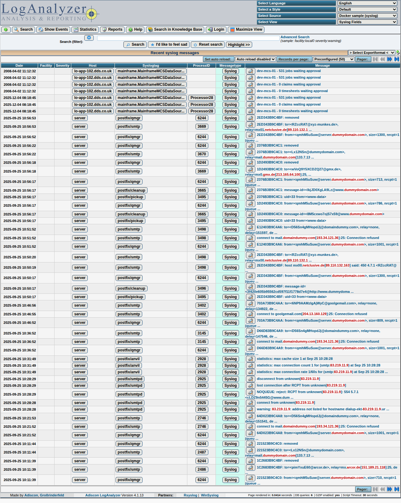
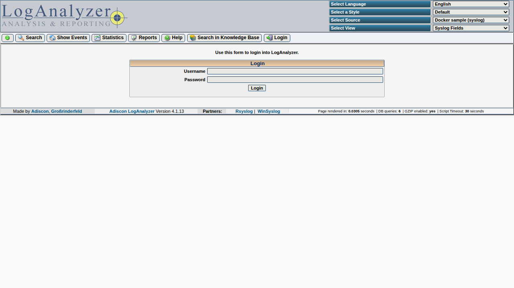
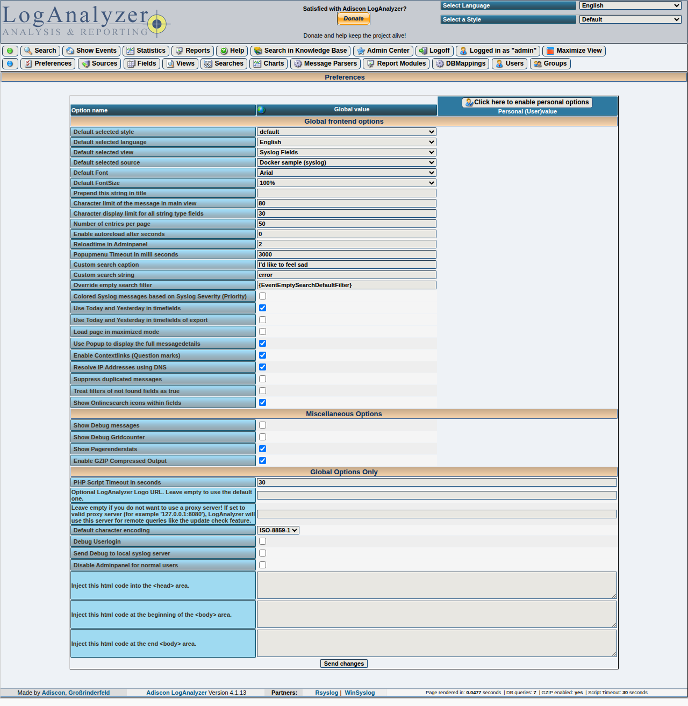
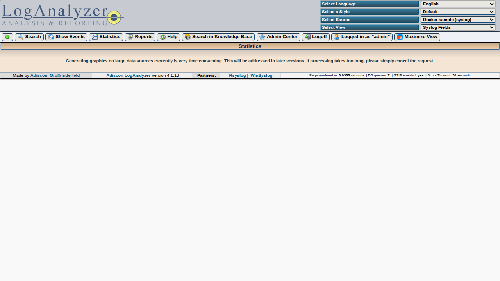
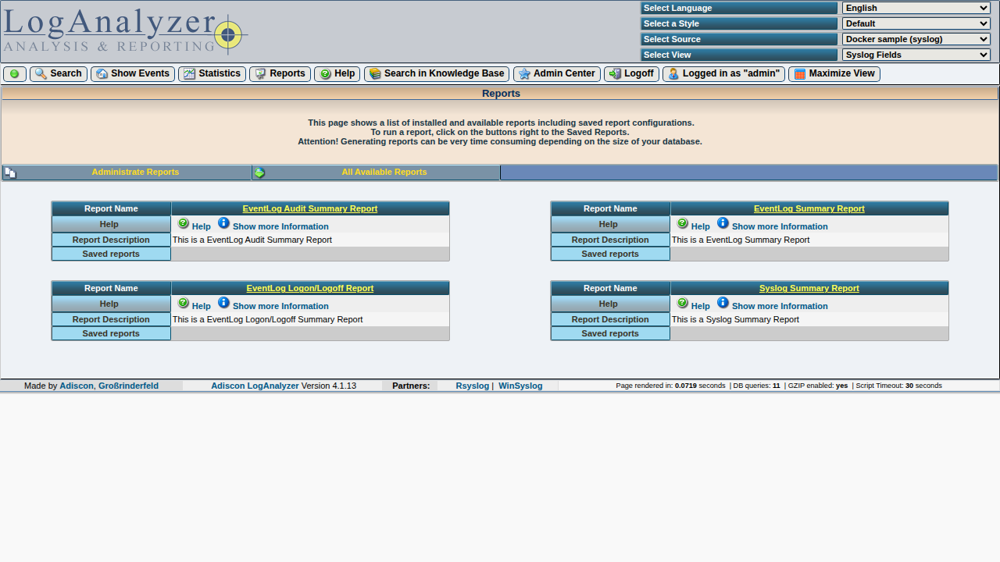

# Quick start

This page matches the seeded **Docker** stack described in [Docker & CI](../docker.md): sample log sources and default admin **`admin`** / **`pass`** (development only).

## Run LogAnalyzer locally

From the repository root:

```bash
docker compose -f docker/docker-compose.yml up --build
```

Open **http://localhost:8080/** (container maps host `8080`).

## Typical flow

1. **Main view** (`index.php`) — browse syslog-style lines from configured sources.

    

2. **Sign in** (`login.php`) — use admin credentials when user management / restricted pages apply.

    

3. **Administration** (`admin/index.php`) — sources, users, and related settings.

    

4. **Statistics** (`statistics.php`) and **Reports** (`reports.php`) — summaries and report views.

    

    

## Screenshots in this handbook

PNG files under `doc-site/docs/assets/user-guide/` are produced with **Playwright** against the E2E stack. To refresh them after UI changes, see [`e2e/README.md` in the repository](https://github.com/rsyslog/loganalyzer/blob/master/e2e/README.md) (**Handbook screenshots**).

## Go deeper

- [Interface map](interface-map.md) — how main areas fit together.
- [User guide overview](../legacy-html-manuals.md) — full list of imported chapters from `doc/`.
- [Installation](../legacy-html/install.md) and [Basics](../legacy-html/basics.md) for configuration and concepts.
